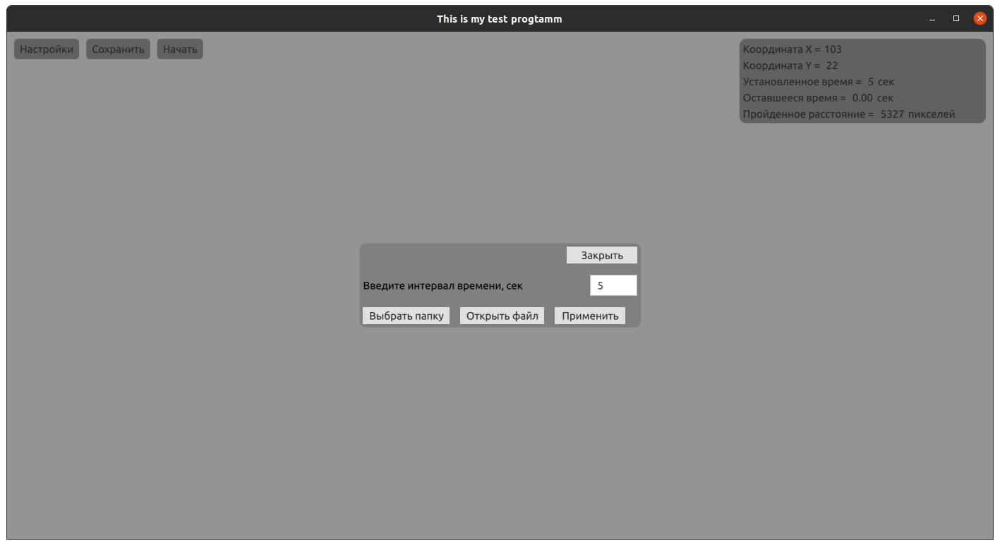

# CppQt_test_task
## Выполнение тестового задания для вакансии программист С++/Qt (junior)
---
## Задание:
1. Разаработать GUI-приложения на базе фрэймворка QT для анализа работы манипулятора мышь
2. GUI приложений реализовать на Русском языке
### Требования к приложению.     
1. Приложение осуществляет рассчет пути движения указателя мыши за заданный интервал времени
2. GUI приложения состоит из двух частей
3. GUI приложения состоит из двух частей
    - Область движения мыши
    - Область отображения текущих координат и пройденного пути в pixel за заданный интервал 
4. Заданный интервал времени должен загружаться/сохраняться в файле настроек приложения
5. Заданный интервал времени задается через отдельный диалог
6. Приложение сохраняет пройденный пути в pixel в файл
    - Сохранение в файл реализовать в отдельном потоке(по возможности)
7. Имя файла имеет вид время.txt(где время - текущая дата/время в формате UTC)
8. Папка с файлами пройденного пути должена загружаться/сохраняться в файле настроек клиента
9. Папка с файлами задается через отдельный диалог
10. Вызов всех диалогов происходит через главное меню приложения

## Интерфейс приложения:

### Использованные инструменты
 - С++17
 - Qt 5.15.2
 - Qt Creator 5.0.2
 - Ubuntu 20.04
