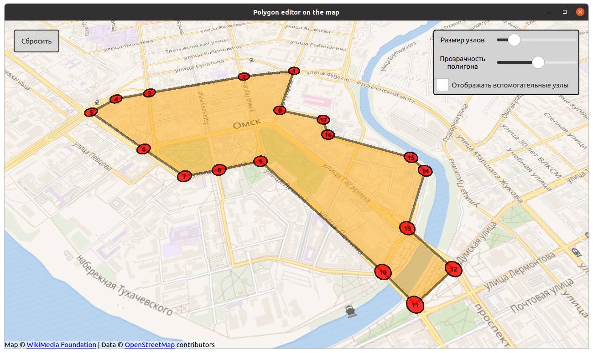

# Polygon editor on the map
## Выполнение тестового задания для вакансии программист С++/Qt
---
## Задание: Разаработать GUI-приложения для создания и редакторования полигонов на карте.

### Функции приложения: 
-  Узлы полигона создаются нажатием ЛКМ
-  Удаление определнного узла делается нажатием ПКМ по нему
-  Удерживая ЛКМ узел можно перемещать
-  Для создание нового узла на ребре необходимо нажать на вспомогательнуй узел ЛКМ, который находится посредине ребра
-  При необходимости можно включить постоянное отображения вспомогательных узлов

---
## Пример работы приложения:

### Использованные инструменты:
 - С++17
 - Qt 5.15.2
 - Qt Creator 5.0.2
 - Ubuntu 20.04
